<div align="center">
  

  # Hey, I'm Anatolii 👋

  

  
</div>

<br/>

> **Lead DevOps Engineer** crafting cloud infrastructure that scales
> 11+ years turning chaos into automation 🚀

## 🎯 What I Do

I build resilient cloud systems and automate everything that shouldn't be done manually. Currently focused on container orchestration, MLOps pipelines, and making infrastructure boring (in a good way).

<div align="center">
  
</div>

## 🛠 Tech Stack

<div align="center">

### Cloud & Infrastructure


### DevOps Pipeline


### Monitoring & Observability


### Languages


</div>

## 🔄 DevOps Workflow

### 📋 Pipeline Architecture

```mermaid
graph LR
    A[🧑‍💻 Code] --> B[🔧 Build]
    B --> C[🧪 Test]
    C --> D[📦 Package]
    D --> E[🚀 Deploy]
    E --> F[📊 Monitor]
    F --> G[📈 Optimize]
    G --> A
```



### 🎯 Core DevOps Practices

<details>
<summary><b>Infrastructure as Code (IaC)</b></summary>

- **Terraform** for multi-cloud provisioning
- **Ansible** for configuration management
- **CloudFormation** for AWS-native deployments
- Git-based version control for all infrastructure
</details>

<details>
<summary><b>CI/CD Pipeline</b></summary>

```yaml
Pipeline:
  - Code Commit:    Git hooks, branch protection
  - Build Stage:    Docker multi-stage builds, dependency caching
  - Test Suite:     Unit tests, integration tests, security scans
  - Quality Gate:   SonarQube analysis, coverage checks
  - Packaging:      Container registry, artifact management
  - Deployment:     Blue-green, canary, rolling updates
  - Monitoring:     Real-time metrics, log aggregation
```
</details>

<details>
<summary><b>Container Orchestration</b></summary>

- **Development**: Docker Compose for local environments
- **Staging**: Kubernetes with Helm charts
- **Production**: EKS/GKE with GitOps (ArgoCD/Flux)
- Service mesh with Istio for microservices
</details>

<details>
<summary><b>Monitoring Stack</b></summary>

| Component | Tools |
|-----------|-------|
| 📊 **Metrics** | Prometheus, Grafana |
| 📝 **Logs** | ELK Stack, Loki |
| 🔍 **Traces** | Jaeger, Zipkin |
| 🚨 **Alerts** | AlertManager, PagerDuty |
| 📈 **APM** | New Relic, DataDog |
</details>

<details>
<summary><b>Security (DevSecOps)</b></summary>

- **Code Scanning**: SonarQube, Snyk
- **Container Security**: Trivy, Aqua Security
- **Secrets Management**: HashiCorp Vault, AWS Secrets Manager
- **Compliance**: BlackDuck, OWASP dependency checks
</details>

## 🔬 Current Projects

- **K8s AI/ML Cluster** - MLOps pipelines for model training and deployment
- **Everything as Code** - Full IaC migration with Terraform/Ansible
- **Container Migration** - Legacy app containerization
- **Smart Home DevOps** - IoT monitoring with Prometheus

## 🎓 Certifications & Learning

**Currently Pursuing:**
- 🎯 AWS Solutions Architect Professional
- 🎯 Certified Kubernetes Administrator (CKA)
- 🎯 MLOps Specialization

## 💡 Philosophy

```python
def my_devops_philosophy():
    while True:
        if manual_process.exists():
            automate(it)
        elif already_automated():
            monitor(it)
        else:
            scale(it)
        sleep(0)  # Never stop improving
```

## 🤝 Let's Connect

I'm always interested in discussing:
- 🛠 Open source DevOps tools
- ☸️ Kubernetes optimization
- 💰 Cloud cost optimization
- 🤖 AI/ML infrastructure

<div align="center">

[](https://github.com/VibeDevOpsing)
[](https://linkedin.com/in/anatoliidubyna)

</div>

---

<div align="center">
  <i>"The best infrastructure is the one you don't notice"</i>

  
  
</div>
